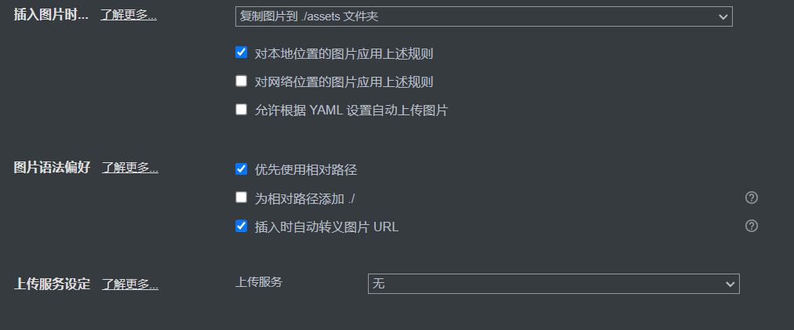

之前写静态从没有考虑过图片问题，今天再用 hugo server 时遇到了图片无法渲染的问题，我基本流程是，使用Typora写md，然后用vscode push到远程渲染，讲一下我怎么解决的。Typora支持你粘贴文件的时候自动创建一个本地JPG文件（或者PNG，whatever），然后创建一个相对路径链接。

如果你像我这样设置就是在你的文章同等级文件夹下创建一个assets存储所有文件，当然，这样Hugo是没有办法渲染的，但是你可以把这个assets文件夹复制粘贴到static文件夹下面，这样渲染结果就可以了，但是一定不要开优先使用相对路径。

over