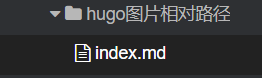

之前写静态从没有考虑过图片问题，今天再用 hugo server 时遇到了图片无法渲染的问题，我基本流程是，使用Typora写md，然后用vscode push到远程渲染，讲一下我怎么解决的。Typora支持你粘贴文件的时候自动创建一个本地JPG文件（或者PNG，whatever），然后创建一个相对路径链接。

每次写文章，运行以下命令

```shell
# 先创建一个文件夹，然后在这个文件夹里面创建以恶index.md，这样就可以渲染相对路径
hugo new content/posts/hugo图片相对路径/index.md
```



over