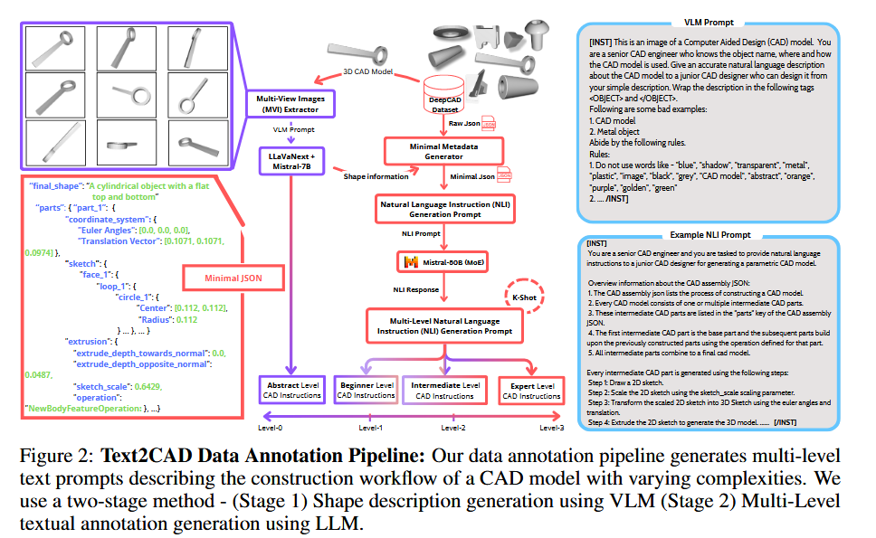

# 基本信息dd
论文地址：http://arxiv.org/abs/2409.17106
repository: https://sadilkhan.github.io/text2cad-project/

# 摘要与背景
## 摘要
在现代软件中制作复杂的计算机辅助设计 (CAD) 模型原型可能非常耗时。这是由于缺乏能够快速生成更简单的中间零件的智能系统。我们提出了 Text2CAD，这是第一个使用适合所有技能水平的设计师友好指令生成文本到参数 CAD 模型的 AI 框架。此外，我们引入了一个数据注释管道，用于使用 Mistral 和 LLaVA-NeXT 根据 DeepCAD 数据集的自然语言指令生成文本提示。该数据集包含 ~ 170K 个模型和 ~ 660K 个文本注释，从抽象 CAD 描述（例如，生成两个同心圆柱体）到详细规范（例如，绘制两个以 (x, y) 为中心、半径为 r1、r2 的圆，并沿d 后正常...）。在 Text2CAD 框架内，我们提出了一种基于端到端 Transformer 的自回归网络，用于从输入文本生成参数化 CAD 模型。我们通过多种指标来评估模型的性能，包括视觉质量、参数精度和几何精度。我们提出的框架在人工智能辅助设计应用中显示出巨大的潜力。项目页面位于 https://sadilkhan.github.io/text2cad-project/。

> 可以将其结合设计，为中间件模型创建文本提示（零件和参数），可以方便搜索
## 创新点
1. 作为第一个使用文本描述生成参数化 3D CAD 模型的 AI 框架
2. 提出了一个数据注释管道，它利用LLM 和VLM 生成一个数据集，其中包含具有不同复杂程度和参数细节的文本提示
3. 提出了一种基于端到端 Transformer 的自回归架构，用于根据输入文本提示生成 CAD 设计历史记录。
# 研究内容
## 算法定义
- Text2CAD数据标注

- Tranformer

## 算法流程

# 实验

# 结论