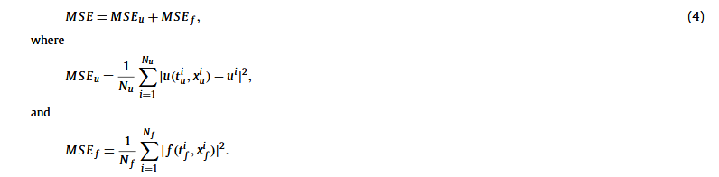

+++
date = '2024-12-17T17:19:58+08:00'
draft = false
title = 'PINN'
+++

# PINN:Physics-informed neural networks: A deep learning framework for solving forward and inverse problems involving nonlinear partial differential equations

## 基本信息

> 论文地址：https://linkinghub.elsevier.com/retrieve/pii/S0021999118307125
>
> github:[maziarraissi/PINNs: Physics Informed Deep Learning: Data-driven Solutions and Discovery of Nonlinear Partial Differential Equations](https://github.com/maziarraissi/PINNs)

## 摘要和背景

我们介绍了物理信息神经网络 – 经过训练以解决监督学习任务的神经网络，同时遵守由一般非线性偏微分方程描述的任何给定物理定律。在这项工作中，我们展示了我们在解决两大类问题的背景下的发展：数据驱动的解决方案和数据驱动的偏微分方程发现。根据可用数据的性质和排列方式，我们设计了两种不同类型的算法，即***连续时间和离散时间模型***。第一种类型的模型形成了一个新的数据高效时空函数逼近器系列，而后一种类型允许使用具有无限阶段数的任意精确的隐式 Runge-Kutta 时间步进方案。通过流体、量子力学、反应扩散系统和非线性浅水波传播中的一系列经典问题证明了所提出的框架的有效性。

随着可用数据和计算资源的爆炸性增长，最近在机器学习和数据分析方面的进展已经在各个科学领域取得了变革性的成果，包括图像识别[1]、认知科学[2]和基因组学[3]。然而，在分析复杂的物理、生物或工程系统的过程中，数据获取的成本往往是禁止性的，我们不可避免地面临着在部分信息下进行决策的挑战。在这种小数据环境下，大多数最先进的机器学习技术（例如深度/卷积/递归神经网络）缺乏鲁棒性，并且无法提供收敛性的保证。在第一眼看来，训练一个深度学习算法来准确识别一个非线性映射从几个 - 可能非常高维 - 输入和输出数据对似乎是幼稚的。幸运的是，对于许多与物理和生物系统建模有关的案例，***存在大量的先验知识，这些知识目前尚未在现代机器学习实践中被利用***。无论是原则上的物理定律来描述系统的时间依赖动态，还是一些实证验证的规则或其他领域的专业知识，这些先验信息都可以作为一种正则化因子来约束可接受解的空间大小（例如，在不可压缩流体动力学问题中，通过丢弃任何违反质量守恒原则的非现实流解）。作为回报，将这些结构化信息编码到学习算法中会扩大数据的信息内容，使算法能够快速找到正确的解，并且即使只有很少的训练示例也能很好地泛化。利用结构化先验信息来构造数据高效和物理信息化的学习机器的前景已经在最近的研究中得到了展示[4-6]。在那里，作者们使用高斯过程回归[7]来设计专门针对给定线性算子的函数表示，并能够准确推断解决方案并为数学物理中的几个原型问题提供不确定性估计。Raissi等人[8,9]在推断和系统识别的背景下提出了对非线性问题的扩展。尽管高斯过程在编码先验信息方面具有灵活性和数学优雅性，但处理非线性问题引入了两个重要的限制。首先，在[8,9]中，作者们必须局部线性化任何非线性项，以时间为单位，从而限制了所提方法的适用性，并损害了他们在强非线性环境中的预测准确性。其次，高斯过程回归的贝叶斯性质要求一定的先验假设，这些假设可能会限制模型的表示能力并导致鲁棒性/脆弱性问题，特别是对于非线性问题[10]。

## 研究内容

在这项工作中，我们采用了一种不同的方法，利用深度神经网络及其作为通用函数逼近器的知名能力。在这种情况下，我们可以直接处理非线性问题，而无需进行任何先验假设、线性化或局部时间步进。我们利用自动微分的最新发展——这是科学计算中最有用但可能未充分利用的技术之一——对神经网络的输入坐标和模型参数进行微分，以获得物理信息神经网络。这些神经网络被约束为遵循源自物理定律的对称性、不变性或守恒原理，这些定律支配着通过一般时间相关和非线性偏微分方程建模的观测数据。这种简单而强大的构造使我们能够处理计算科学中的广泛问题，并引入一种潜在的变革性技术，促进新型数据高效和物理信息学习机器的发展、新类别的偏微分方程数值求解器以及模型反演和系统识别的新数据驱动方法。

这项工作的总体目标是为建模和计算的新范式奠定基础，丰富深度学习与数学物理的长期发展。为此，我们的手稿分为两部分，旨在介绍我们在两类主要问题背景下的发展：数据驱动的解和数据驱动的偏微分方程发现。所有代码和数据集都可以在GitHub上获取：https://github.com/maziarraissi/PINNs。在整个工作中，我们一直使用相对简单的深度前馈神经网络架构，采用双曲正切激活函数，并且没有额外的正则化（例如，L1/L2惩罚、dropout等）。手稿中的每个数值示例都附有关于我们使用的神经网络架构的详细讨论，以及其训练过程的详细信息（例如，优化器、学习率等）。最后，附录A和附录B提供了一系列系统研究，旨在展示所提出方法的性能。

在这项工作中，我们考虑参数化和非线性偏微分方程，其一般形式为

$$
u_t + \mathcal{N}[u ; \lambda] = 0, \, x \in \Omega, \, t \in [0, T]
$$

其中, $u(t, x)$是一个潜在解，$\mathcal{N}[\cdot, \lambda]$是由$\lambda$确定的非线性算子

首先，定义

然后要使用神经网络逼近$u(t,x)$，假设一个和u有一样参数的物理神经网络$f(t,x)$，然后通过最小MSE来学习u和f的共享参数

在这里，我们应该强调这种工作与现有文献中关于计算物理学中机器学习应用的区别。术语“物理信息机器学习”最近也在湍流建模的背景下被Wang等人使用。其他预测物理系统建模的方法包括支持向量机、随机森林、高斯过程，以及前馈/卷积/递归神经网络等机器学习算法。所有这些方法都仅仅将神经网络作为“黑箱”工具来使用。如上所述，所提出的工作旨在通过重新构建“定制”激活函数和损失函数来进一步发展，这些函数量身定制以适应底层的微分算子。这使我们能够通过理解和欣赏自动微分在深度学习领域内所扮演的关键角色来打开黑箱。一般而言，自动微分，特别是反向传播算法，目前是训练深度模型时通过对参数（例如，权重和偏置）进行自动求导的主导方法。在这里，我们使用与深度学习社区中使用的相同的自动微分技术，将神经网络与输入坐标（即空间和时间）的偏导数相联系，其中物理学由偏微分方程描述。我们通过实验观察到，这种结构化方法引入了一种正则化机制，使我们能够使用相对简单的前馈神经网络架构并用少量数据进行训练。这种简单方法的有效性可能与Lin、Tegmark和Rolnick提出的标量场理论有关，并提出了许多未来研究中需要定量解决的有趣问题。为此，所提出的工作借鉴了Psichogios和Unger、Lagaris等人的早期贡献，以及Kondor、Hirn和Mallat等人的现代作品的灵感。

在所有涉及偏微分方程数据驱动求解的情况下，训练数据的总量Nu**N**u相对较小（几百到几千个点），我们选择使用L-BFGS等优化所有损失函数的准牛顿全批量梯度优化算法。对于较大的数据集，如第4节中讨论的数据驱动模型发现例子，可以很容易地在小批量设置中使用随机梯度下降及其现代变体。尽管事实上没有理论保证该过程会收敛到全局最优解，但我们的经验证据表明，如果给定的偏微分方程是适定的并且其解是唯一的，我们的方法在给定足够的神经网络架构和适当数量的配置点的情况下能够实现良好的预测精度。这种一般观察与通过方程(4)的均方误差损失定义的优化景观深刻相关，并为与深度学习理论发展同步的研究开辟了一个开放问题。为此，我们将测试所提出方法的稳健性，使用在附录A和附录B中提供的一系列系统敏感性研究。

### 自动微分技术

> 参考：[自动微分 - 李理的博客](https://fancyerii.github.io/books/autodiff/)

## 算法

## 实验
