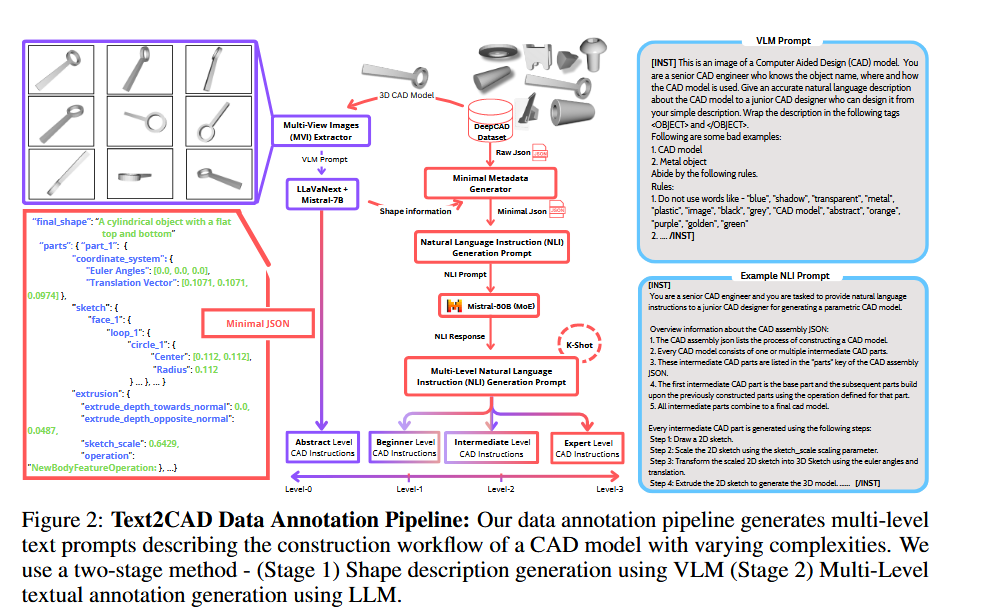
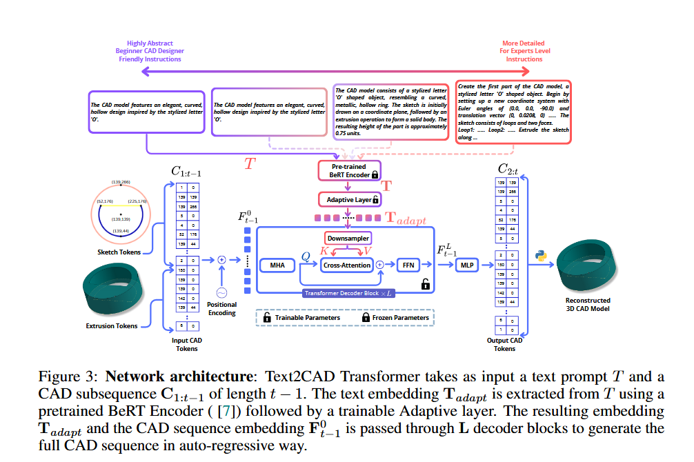
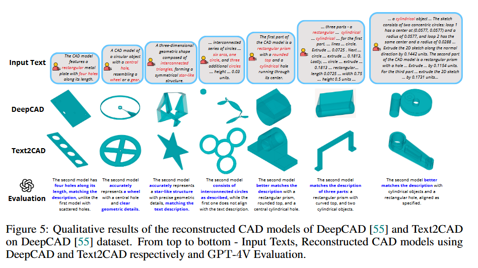

# 基本信息dd
论文地址：http://arxiv.org/abs/2409.17106
repository: https://sadilkhan.github.io/text2cad-project/

# 摘要与背景
## 摘要
在现代软件中制作复杂的计算机辅助设计 (CAD) 模型原型可能非常耗时。这是由于缺乏能够快速生成更简单的中间零件的智能系统。我们提出了 Text2CAD，这是第一个使用适合所有技能水平的设计师友好指令生成文本到参数 CAD 模型的 AI 框架。此外，我们引入了一个数据注释管道，用于使用 Mistral 和 LLaVA-NeXT 根据 DeepCAD 数据集的自然语言指令生成文本提示。该数据集包含 ~ 170K 个模型和 ~ 660K 个文本注释，从抽象 CAD 描述（例如，生成两个同心圆柱体）到详细规范（例如，绘制两个以 (x, y) 为中心、半径为 r1、r2 的圆，并沿d 后正常...）。在 Text2CAD 框架内，我们提出了一种基于端到端 Transformer 的自回归网络，用于从输入文本生成参数化 CAD 模型。我们通过多种指标来评估模型的性能，包括视觉质量、参数精度和几何精度。我们提出的框架在人工智能辅助设计应用中显示出巨大的潜力。项目页面位于 https://sadilkhan.github.io/text2cad-project/。

> 可以将其结合设计，为中间件模型创建文本提示（零件和参数），可以方便搜索
## 创新点
1. 作为第一个使用文本描述生成参数化 3D CAD 模型的 AI 框架
2. 提出了一个数据注释管道，它利用LLM 和VLM 生成一个数据集，其中包含具有不同复杂程度和参数细节的文本提示
3. 提出了一种基于端到端 Transformer 的自回归架构，用于根据输入文本提示生成 CAD 设计历史记录。
# 研究内容
## 算法定义
### Text2CAD数据标注

- 使用vllm进行形状描述

  首先从预定的摄像机角度为每个单独的零件和最终的 CAD 模型生成多视图图像。然后，这些图像在 LLaVANeXT [25] 模型的预定义提示

- 多层级设计架构

  DeepCAD [55] 数据集包含 JSON 格式的 CAD 构造序列。我们首先使用“最小元数据生成器”对原始 CAD 构造序列进行预处理，该生成器用更有意义的术语（例如“part_1”、“loop_1”）替换随机、无意义的键。

### Text2CAD Transformer

Bert-encoder, 自回归, 自适应层

Text2CAD Transformer 将文本提示 T 和长度为 t − 1 的 CAD 子序列$C_{1:t-1}$作为输入。使用预训练的 BeRT 编码器 ([7]) 从 T 中提取文本嵌入$T_{adapt}$，然后使用可训练的自适应层。生成的嵌入 Tadapt 和 CAD 序列嵌入$F_{t-1}^0$通过 L 解码器块，以自回归生成完整的 CAD 序列

## 算法流程

# 实验

## 评估

# 结论

这是第一个 AI 框架，旨在根据适合所有技能水平的用户的文本提示生成参数化 CAD 模型。我们的贡献包括使用 Mistral-50B 和 LLaVA-NeXT 的两阶段数据注释管道以及新颖的端到端可训练 Text2CAD Transformer 架构，该架构可有效地将自然语言指令转换为顺序 CAD 模型。通过全面的评估，包括 GPT-4V 评估和 CAD 设计人员的用户研究，我们证明 Text2CAD 优于现有的两阶段基线，特别是随着提示的复杂性和细节的增加。未来的工作将侧重于解决当前的局限性，例如减少注释不准确和提高数据集多样性，以进一步增强 Text2CAD 的稳健性和适用性

## 限制

尽管 Text2CAD 取得了令人鼓舞的结果，但仍存在一些局限性。首先，LLaVA-NeXT [25]对多视图图像中的透视扭曲很敏感，这会影响生成的形状描述和最终LLM生成的提示。其次，缺乏评估文本到 CAD 生成的标准化基准，给全面评估模型性能带来了挑战。此外，DeepCAD [55] 数据集是不平衡的，主要具有矩形和圆柱形形状，这限制了模型对更复杂形状的鲁棒性。补充第 15 节描述了一些失败案例。

